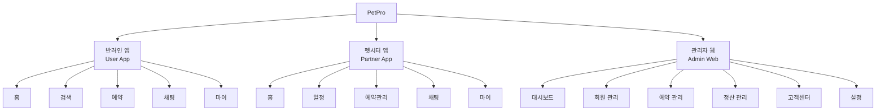
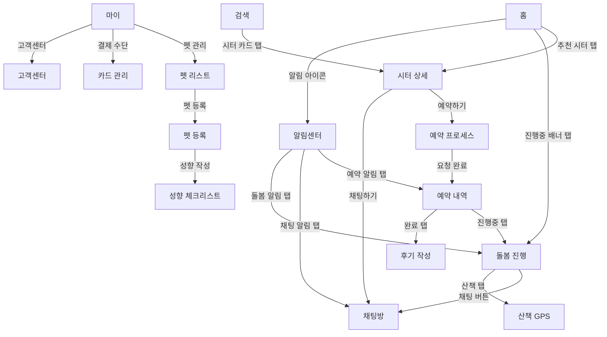
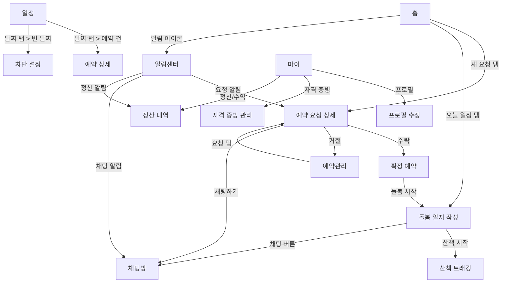
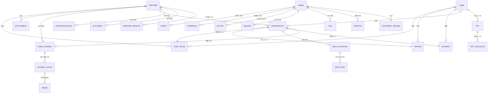

# PetPro Information Architecture (IA) - Final
## 정보 구조 설계서 (크롤링 참조 통합본)

---

## 1. 문서 개요

| 항목 | 내용 |
|------|------|
| **프로젝트명** | PetPro - AI 기반 반려동물 돌봄 플랫폼 |
| **문서 버전** | v2.0 (크롤링 참조 통합) |
| **작성일** | 2026-02-06 |
| **대상 범위** | P0 기능 기준 + 경쟁사 참조 기능 |
| **참조 사이트** | 펫프렌즈(m.pet-friends.co.kr), 포인핸드(pawinhand.kr) |

---

## 2. 전체 서비스 IA 맵



---

## 3. 반려인(User) 앱 IA

### 3.1 전체 구조

```mermaid
graph TD
    APP[반려인 앱] --> ONBOARD[온보딩]
    APP --> TAB1[홈]
    APP --> TAB2[검색]
    APP --> TAB3[예약]
    APP --> TAB4[채팅]
    APP --> TAB5[마이]
    APP --> COMMON[공통]

    %% 온보딩
    ONBOARD --> OB1[앱 소개 슬라이드]
    OB1 --> OB1_1[권한 동의]
    OB1_1 --> OB1_1A[위치 기반 서비스 동의]
    OB1_1 --> OB1_1B[저장공간/미디어 권한 동의]
    OB1_1 --> OB1_1C[알림 푸시 권한 동의]
    ONBOARD --> OB2[소셜 로그인]
    ONBOARD --> OB3[사용자 유형 선택]
    ONBOARD --> OB4[초기 프로필 설정]
    ONBOARD --> OB5[펫 등록 안내]

    %% 홈
    TAB1 --> H1[추천 시터 리스트]
    TAB1 --> H2[진행중 돌봄 배너]
    TAB1 --> H3[최근 이용 시터]
    TAB1 --> H4[이벤트/공지 배너]
    TAB1 --> H5[커뮤니티 피드 요약]

    %% 검색
    TAB2 --> S1[검색 조건 입력]
    TAB2 --> S2[검색 결과]
    TAB2 --> S3[시터 상세]
    S1 --> S1_1[지역 설정<br/>지도/주소]
    S1 --> S1_2[날짜 선택]
    S1 --> S1_3[서비스 유형]
    S2 --> S2_1[리스트뷰]
    S2 --> S2_2[지도뷰]
    S2 --> S2_3[필터/정렬]
    S3 --> S3_1[소개 탭]
    S3 --> S3_2[환경 탭]
    S3 --> S3_3[요금 탭]
    S3 --> S3_4[후기 탭]
    S3 --> S3_5[예약하기]

    %% 예약
    TAB3 --> R1[예약 요청 프로세스]
    TAB3 --> R2[예약 내역]
    TAB3 --> R3[돌봄 진행 화면]
    R1 --> R1_1[일정 선택]
    R1 --> R1_2[펫 선택]
    R1 --> R1_3[견적 확인]
    R1 --> R1_4[요청사항 입력]
    R1 --> R1_5[요청 확인/발송]
    R2 --> R2_1[대기중]
    R2 --> R2_2[예정]
    R2 --> R2_3[진행중]
    R2 --> R2_4[완료]
    R2 --> R2_5[취소]
    R3 --> R3_1[돌봄 일지 타임라인]
    R3 --> R3_2[산책 GPS 실시간]
    R3 --> R3_3[돌봄 히스토리]

    %% 결제
    R1_5 --> PAY1[결제 화면]
    PAY1 --> PAY1_1[카드 선택/등록]
    PAY1 --> PAY1_2[결제 금액 확인]
    PAY1 --> PAY1_3[결제 처리]
    PAY1 --> PAY1_4[결제 완료]

    %% 채팅
    TAB4 --> C1[채팅 목록]
    TAB4 --> C2[채팅방]
    C2 --> C2_1[텍스트 메시지]
    C2 --> C2_2[이미지 전송]
    C2 --> C2_3[동영상 전송]
    C2 --> C2_4[예약 정보 카드]

    %% 마이
    TAB5 --> M1[내 프로필]
    TAB5 --> M2[펫 관리]
    TAB5 --> M3[결제 수단 관리]
    TAB5 --> M4[알림 설정]
    TAB5 --> M5[고객센터]
    TAB5 --> M6[설정]
    TAB5 --> M7[커뮤니티 활동]
    TAB5 --> M8[회원등급 안내]
    TAB5 --> M9[친구 초대]
    M2 --> M2_1[펫 리스트]
    M2 --> M2_2[펫 등록/수정]
    M2 --> M2_3[성향 체크리스트]
    M3 --> M3_1[카드 리스트]
    M3 --> M3_2[카드 추가/삭제]
    M5 --> M5_1[FAQ]
    M5 --> M5_2[1:1 문의]
    M5 --> M5_3[문의 이력]
    M6 --> M6_1[계정 관리]
    M6 --> M6_2[약관/정책]
    M6 --> M6_3[앱 정보]
    M6 --> M6_4[비밀번호 변경]
    M6 --> M6_5[회원 탈퇴]

    %% 공통
    COMMON --> CM1[알림센터]
    COMMON --> CM2[본인 인증]
```



### 3.2 반려인 앱 Depth 구조 테이블

| Depth 1 (탭) | Depth 2 | Depth 3 | Depth 4 | 화면 ID | 참조 |
|---------------|---------|---------|---------|---------|------|
| **온보딩** | 앱 소개 슬라이드 | - | - | S-001 | |
| | 위치 기반 서비스 동의 | - | - | S-001-1 | |
| | 저장공간/미디어 권한 동의 | - | - | S-001-2 | |
| | 알림(푸시) 권한 동의 | - | - | S-001-3 | |
| | 소셜 로그인 | - | - | S-002 | PF: /auth/signin (카카오/네이버/애플) |
| | 이메일 로그인 | - | - | S-002-1 | PF: /auth/signin/email |
| | 이메일 회원가입 | - | - | S-003 | PF: /auth/signup/email |
| | 소셜 회원가입 | - | - | S-003-1 | PF: /auth/signup/{provider} |
| | 계정 연결 | - | - | S-003-2 | PF: /auth/account/link |
| | 아이디/비밀번호 찾기 | - | - | S-004 | PF: /auth/signin/email/find |
| | 사용자 유형 선택 | - | - | S-005 | |
| | 초기 프로필 설정 | - | - | - | |
| | 앱 권한 안내 | - | - | - | PF: /auth/permission |
| | 펫 등록 안내 | - | - | - | PF: /pet/register |
| **홈** | 추천 시터 리스트 | - | - | - | |
| | 진행중 돌봄 배너 | 돌봄 진행 화면 | - | U-CARE-001 | |
| | 최근 이용 시터 | 시터 상세 | - | U-SRCH-002 | |
| | 이벤트/공지 배너 | - | - | - | PF: /main/events |
| | 커뮤니티 피드 요약 | - | - | - | PF: /community, PH: /story |
| **검색** | 검색 조건 입력 | 지역 설정 | - | U-SRCH-001 | |
| | | 날짜 선택 | - | | |
| | | 서비스 유형 | - | | |
| | 검색 결과 | 리스트뷰 | - | U-SRCH-001 | |
| | | 지도뷰 | - | U-SRCH-001 | PH: 카카오맵 연동 |
| | | 필터/정렬 | - | | PF: 인기순 등 정렬 |
| | 시터 상세 | 소개 탭 | - | U-SRCH-002 | PH: /shelter/home/:idx/info |
| | | 환경 탭 | - | | |
| | | 요금 탭 | - | | |
| | | 후기 탭 | - | | PH: /story (후기 참조) |
| **예약** | 예약 요청 | Step 1: 일정 선택 | - | U-RSV-001 | |
| | | Step 2: 펫 선택 | - | U-RSV-002 | |
| | | Step 3: 견적 확인 | - | U-RSV-003 | |
| | | Step 4: 요청사항 | - | U-RSV-004 | |
| | | 결제 화면 | 카드 선택/등록 | U-PAY-001 | PF: /v2/order |
| | 예약 내역 | 대기중 | 예약 상세 | | PF: /order-history/list |
| | | 예정 | 예약 상세 | | |
| | | 진행중 | 돌봄 진행 화면 | U-CARE-001 | |
| | | 완료 | 후기 작성 | | PF: /review/new |
| | | 취소 | - | | PF: /exchange-return/policy |
| | 돌봄 진행 화면 | 돌봄 일지 타임라인 | 일지 상세 | U-CARE-001 | |
| | | 산책 GPS 실시간 | 경로 지도 | | |
| **채팅** | 채팅 목록 | - | - | CHAT-001 | |
| | 채팅방 | - | - | CHAT-002 | |
| **마이** | 내 프로필 | 프로필 수정 | - | | PF: /my/information |
| | 펫 관리 | 펫 리스트 | - | U-PET-001 | PF: /pet |
| | | 펫 등록/수정 | - | U-PET-002 | PF: /pet/register |
| | | 성향 체크리스트 | - | U-PET-003 | |
| | 결제 수단 관리 | 카드 리스트 | 카드 추가 | | |
| | 주문/결제 내역 | - | - | | PF: /order-history/list |
| | 회원등급 안내 | - | - | | PF: /my/grade/info |
| | 알림 설정 | - | - | | PF: /my/alarm |
| | 친구 초대 | - | - | | PF: /my/invite/friends |
| | 커뮤니티 활동 | 내 게시글/댓글 | - | | PF: /my/community |
| | 고객센터 | FAQ | - | CMN-CS-001 | PH: /question |
| | | 1:1 문의 | 문의 작성 | | |
| | | 문의 이력 | 문의 상세 | | |
| | 설정 | 계정 관리 | 로그아웃/탈퇴 | CMN-SET-001 | PF: /my/withdraw |
| | | 비밀번호 변경 | - | | PF: /my/password/change |
| | | 비밀번호 확인 | - | | PF: /my/password/check |
| | | 약관/정책 | - | | PF: /policies/{type}/{date} |
| | | 앱 정보 | - | | |
| **공통** | 알림센터 | 알림 상세 (딥링크) | - | CMN-NOTI-001 | |
| | 본인 인증 | PASS/문자/카카오 | - | | |
| | 주소 관리 | - | - | | PF: /address |
| | 배송 안내 | - | - | | PF: /guide/delivery/type |

> **참조 범례**: PF = 펫프렌즈, PH = 포인핸드

---

## 4. 펫시터(Partner) 앱 IA

### 4.1 전체 구조

```mermaid
graph TD
    APP[펫시터 앱] --> ONBOARD[온보딩]
    APP --> TAB1[홈]
    APP --> TAB2[일정]
    APP --> TAB3[예약관리]
    APP --> TAB4[채팅]
    APP --> TAB5[마이]
    APP --> COMMON[공통]

    %% 온보딩
    ONBOARD --> OB0[앱 소개 슬라이드]
    OB0 --> OB0_1[권한 동의]
    OB0_1 --> OB0_1A[위치 기반 서비스 동의]
    OB0_1 --> OB0_1B[저장공간/미디어 권한 동의]
    OB0_1 --> OB0_1C[알림 푸시 권한 동의]
    ONBOARD --> OB1[소셜 로그인]
    ONBOARD --> OB2[본인 인증]
    ONBOARD --> OB3[프로필 설정]
    ONBOARD --> OB4[자격 증빙 제출]
    ONBOARD --> OB5[심사 대기]
    OB3 --> OB3_1[기본 정보]
    OB3 --> OB3_2[활동 정보]
    OB3 --> OB3_3[환경 사진]
    OB3 --> OB3_4[서비스 & 요금]

    %% 홈
    TAB1 --> H1[오늘의 일정 요약]
    TAB1 --> H2[새 예약 요청 알림]
    TAB1 --> H3[수익 요약]
    TAB1 --> H4[공지사항]

    %% 일정
    TAB2 --> SC1[월간 캘린더]
    SC1 --> SC1_1[날짜 상세<br/>차단/해제]
    SC1 --> SC1_2[기간 선택 차단]
    SC1 --> SC1_3[예약 확정 일정 보기]

    %% 예약관리
    TAB3 --> RV1[예약 요청 리스트]
    TAB3 --> RV2[확정 예약 리스트]
    TAB3 --> RV3[진행중 돌봄]
    TAB3 --> RV4[완료 내역]
    RV1 --> RV1_1[요청 상세]
    RV1_1 --> RV1_2[수락]
    RV1_1 --> RV1_3[거절<br/>사유 선택]
    RV3 --> RV3_1[돌봄 일지 작성]
    RV3 --> RV3_2[산책 GPS 트래킹]
    RV3_1 --> RV3_1A[식사 기록]
    RV3_1 --> RV3_1B[배변 기록]
    RV3_1 --> RV3_1C[놀이/활동 기록]
    RV3_1 --> RV3_1D[간식 기록]
    RV3_1 --> RV3_1E[컨디션 체크]
    RV3_1 --> RV3_1F[자유 기록]

    %% 채팅
    TAB4 --> C1[채팅 목록]
    TAB4 --> C2[채팅방]

    %% 마이
    TAB5 --> MY1[시터 프로필]
    TAB5 --> MY2[자격 증빙 관리]
    TAB5 --> MY3[정산/수익]
    TAB5 --> MY4[알림 설정]
    TAB5 --> MY5[고객센터]
    TAB5 --> MY6[설정]
    MY1 --> MY1_1[프로필 수정]
    MY1 --> MY1_2[환경 사진 관리]
    MY1 --> MY1_3[서비스 & 요금 수정]
    MY2 --> MY2_1[심사 상태 확인]
    MY2 --> MY2_2[서류 재제출]
    MY3 --> MY3_1[수익 현황]
    MY3 --> MY3_2[정산 내역]
    MY3 --> MY3_3[계좌 정보 관리]

    %% 공통
    COMMON --> CM1[알림센터]
```



### 4.2 펫시터 앱 Depth 구조 테이블

| Depth 1 (탭) | Depth 2 | Depth 3 | Depth 4 | 화면 ID | 참조 |
|---------------|---------|---------|---------|---------|------|
| **온보딩** | 앱 소개 슬라이드 | - | - | S-001 | |
| | 위치 기반 서비스 동의 | - | - | S-001-1 | |
| | 저장공간/미디어 권한 동의 | - | - | S-001-2 | |
| | 알림(푸시) 권한 동의 | - | - | S-001-3 | |
| | 소셜 로그인 | - | - | S-002 | PF: /auth/signin |
| | 본인 인증 | - | - | | |
| | 프로필 설정 | Step 1: 기본 정보 | - | P-PRF-001 | |
| | | Step 2: 활동 정보 | - | | |
| | | Step 3: 환경 사진 | - | | |
| | | Step 4: 서비스 & 요금 | - | | |
| | 자격 증빙 제출 | 필수 서류 업로드 | - | P-PRF-002 | |
| | | 선택 자격증 업로드 | - | | |
| | 심사 대기 | - | - | P-PRF-003 | PH: pasm.kr 참조 |
| **홈** | 오늘의 일정 요약 | 예약 상세 이동 | - | | |
| | 새 예약 요청 | 요청 상세 이동 | - | | |
| | 수익 요약 | 정산 상세 이동 | - | | |
| | 공지사항 | 공지사항 리스트 | 공지사항 상세 | | PH: /notice |
| **일정** | 월간 캘린더 | 날짜 상세 | 차단 설정/해제 | P-CAL-001 | |
| | | 기간 선택 차단 | - | | |
| | | 예약 일정 보기 | 예약 상세 | | |
| **예약관리** | 예약 요청 리스트 | 요청 상세 | 수락 | P-RSV-001 | |
| | | | 거절 (사유 선택) | | |
| | 확정 예약 리스트 | 예약 상세 | - | | |
| | 진행중 돌봄 | 돌봄 일지 작성 | 식사/배변/놀이/간식/컨디션/자유 | P-CARE-001 | |
| | | 산책 GPS 트래킹 | 경로 지도 | P-CARE-002 | |
| | | 돌봄 종료 | 요약 코멘트 | | |
| | 완료 내역 | 완료 상세 | - | | |
| **채팅** | 채팅 목록 | - | - | CHAT-001 | |
| | 채팅방 | - | - | CHAT-002 | |
| **마이** | 시터 프로필 | 프로필 수정 | - | P-PRF-001 | |
| | | 환경 사진 관리 | - | | |
| | | 서비스 & 요금 수정 | - | | |
| | 자격 증빙 관리 | 심사 상태 확인 | - | P-PRF-003 | |
| | | 서류 재제출 | - | P-PRF-002 | |
| | 정산/수익 | 수익 현황 | - | | |
| | | 정산 내역 | - | | |
| | | 계좌 정보 관리 | - | | |
| | 알림 설정 | - | - | | PF: /my/alarm |
| | 고객센터 | FAQ | - | CMN-CS-001 | PH: /question |
| | | 1:1 문의 | 문의 작성 | | |
| | | 문의 이력 | 문의 상세 | | |
| | 설정 | 계정 관리 | 로그아웃/탈퇴 | CMN-SET-001 | PF: /my/withdraw |
| | | 비밀번호 변경 | - | | PF: /my/password/change |
| | | 비밀번호 확인 | - | | PF: /my/password/check |
| | | 약관/정책 | - | | PF: /policies/{type}/{date} |
| | | 앱 정보 | - | | |
| | | 회원 탈퇴 | - | | |
| **공통** | 알림센터 | 알림 상세 (딥링크) | - | CMN-NOTI-001 | |
| | 본인 인증 | PASS/문자/카카오 | - | | |

---

## 5. 관리자(Admin) 웹 IA

### 5.1 전체 구조

```mermaid
graph TD
    ADMIN[관리자 웹] --> AUTH[인증]
    ADMIN --> MENU1[대시보드]
    ADMIN --> MENU2[회원 관리]
    ADMIN --> MENU3[예약 관리]
    ADMIN --> MENU4[정산 관리]
    ADMIN --> MENU5[고객센터]
    ADMIN --> MENU6[콘텐츠 관리]
    ADMIN --> MENU7[설정]

    %% 인증
    AUTH --> AUTH1[관리자 로그인<br/>이메일/비밀번호]

    %% 대시보드
    MENU1 --> D1[KPI 카드<br/>오늘의 예약/완료/취소]
    MENU1 --> D2[주간/월간 예약 추이 차트]
    MENU1 --> D3[긴급 알림<br/>미처리 심사/분쟁]
    MENU1 --> D4[정산 현황 요약]
    MENU1 --> D5[통계 대시보드]
    MENU1 --> D6[시스템 모니터링<br/>서버 상태/API 에러율 P2]

    %% 회원 관리
    MENU2 --> U1[반려인 관리]
    MENU2 --> U2[펫시터 관리]
    MENU2 --> U3[시터 심사]
    U1 --> U1_1[반려인 리스트]
    U1 --> U1_2[반려인 상세<br/>프로필/펫/예약이력]
    U2 --> U2_1[시터 리스트]
    U2 --> U2_2[시터 상세<br/>프로필/서류/활동이력]
    U3 --> U3_1[신규 심사 대기 리스트]
    U3 --> U3_2[서류 열람/검토]
    U3 --> U3_3[승인/반려/보류 처리]
    U3 --> U3_4[심사 이력 로그]

    %% 예약 관리
    MENU3 --> R1[예약 현황]
    MENU3 --> R2[분쟁 관리]
    R1 --> R1_1[전체 예약 리스트<br/>필터: 상태/기간/지역]
    R1 --> R1_2[예약 상세<br/>반려인/시터/펫/상태이력]
    R2 --> R2_1[분쟁 리스트]
    R2 --> R2_2[분쟁 상세<br/>양측 내역 확인]
    R2 --> R2_3[중재 처리<br/>환불/패널티]

    %% 정산 관리
    MENU4 --> P1[정산 리스트]
    MENU4 --> P2[수수료 설정]
    P1 --> P1_1[정산 대기 건 조회]
    P1 --> P1_2[일괄 정산 처리]
    P1 --> P1_3[CSV/Excel 다운로드]
    P1 --> P1_4[정산 완료 내역]

    %% 고객센터
    MENU5 --> CS1[1:1 문의 관리]
    MENU5 --> CS2[FAQ 관리]
    CS1 --> CS1_1[문의 리스트<br/>접수/처리중/완료]
    CS1 --> CS1_2[문의 상세/답변]
    CS2 --> CS2_1[FAQ 카테고리 관리]
    CS2 --> CS2_2[FAQ 등록/수정/삭제]

    %% 콘텐츠 관리
    MENU6 --> CT1[공지사항 관리]
    MENU6 --> CT2[이벤트/배너 관리]
    MENU6 --> CT3[커뮤니티 관리]
    MENU6 --> CT4[캠페인 관리]

    %% 설정
    MENU7 --> SET1[알림 템플릿 관리]
    MENU7 --> SET2[약관/정책 관리]
    MENU7 --> SET3[관리자 계정 관리]
    SET3 --> SET3_1[관리자 프로필<br/>비밀번호 변경]
    MENU7 --> SET4[앱 버전 관리]
    MENU7 --> SET5[감사 로그<br/>관리자 활동 이력/접근 로그]
```



### 5.2 관리자 웹 Depth 구조 테이블

| Depth 1 (GNB) | Depth 2 (LNB) | Depth 3 | Depth 4 | 화면 ID | 참조 |
|----------------|----------------|---------|---------|---------|------|
| **인증** | 관리자 로그인 | 이메일/비밀번호 | - | ADM-LOGIN | |
| **대시보드** | KPI 현황 | - | - | ADM-001 | |
| | 예약 추이 차트 | - | - | | |
| | 긴급 알림 | - | - | | |
| | 통계 대시보드 | - | - | | PH: /service/statistics |
| | 시스템 모니터링 (P2) | 서버 상태 | - | | |
| | | API 에러율 | - | | |
| **회원 관리** | 반려인 관리 | 반려인 리스트 | 반려인 상세 | | PF: 회원등급 시스템 |
| | 펫시터 관리 | 시터 리스트 | 시터 상세 | | PH: /shelter/shelter (보호소 관리 참조) |
| | 시터 심사 | 심사 대기 리스트 | 서류 열람/검토 | ADM-002 | PH: pasm.kr (보호소관리시스템) |
| | | | 승인/반려/보류 | | |
| | | 심사 이력 | - | | |
| **예약 관리** | 예약 현황 | 예약 리스트 | 예약 상세 | ADM-003 | PF: /order-history |
| | | | 상태 이력 타임라인 | | |
| | 분쟁 관리 | 분쟁 리스트 | 분쟁 상세 | | PF: /exchange-return/policy |
| | | | 중재 처리 | | |
| **정산 관리** | 정산 리스트 | 정산 대기 조회 | - | ADM-004 | |
| | | 일괄 정산 처리 | - | | |
| | | 정산 완료 내역 | - | | |
| | | CSV/Excel 다운로드 | - | | |
| | 수수료 설정 | 수수료율 관리 | - | | |
| **고객센터** | 1:1 문의 관리 | 문의 리스트 | 문의 상세/답변 | | |
| | FAQ 관리 | 카테고리 관리 | - | | PH: /question (12개 FAQ) |
| | | FAQ 등록/수정/삭제 | - | | |
| **콘텐츠 관리** | 공지사항 관리 | 공지 리스트 | 공지 등록/수정 | | PH: /notice (369개) |
| | 이벤트/배너 관리 | 이벤트 리스트 | 이벤트 등록/수정 | | PF: /main/events |
| | 커뮤니티 관리 | 게시글 관리 | 게시글 상세 | | PF: /community 카테고리 관리 |
| | 캠페인 관리 | 캠페인 리스트 | 캠페인 등록/수정 | | PH: /campaign (3개) |
| **설정** | 알림 템플릿 | 템플릿 리스트 | 템플릿 수정 | | |
| | 약관/정책 | 약관 리스트 | 약관 수정 | | PF: /policies/{type}/{date} 버전관리 |
| | 관리자 계정 | 계정 리스트 | 권한 관리 | | |
| | | 관리자 프로필 | 비밀번호 변경 | | |
| | 감사 로그 | 관리자 활동 이력 | - | | |
| | | 접근 로그 | - | | |
| | 앱 버전 | 버전 이력 | 강제 업데이트 설정 | | |

---

## 6. 화면 간 연결 관계 (Cross Navigation)

### 6.1 반려인 앱 주요 화면 이동 관계



### 6.2 펫시터 앱 주요 화면 이동 관계



---

## 7. 데이터 객체 관계도



---

## 8. 사용자별 접근 가능 화면 매트릭스

| 화면 영역 | 반려인 | 펫시터 | 관리자 | 비로그인 |
|-----------|:------:|:------:|:------:|:--------:|
| 온보딩/로그인 | O | O | - | O |
| 홈 | O | O | - | - |
| 시터 검색 | O | - | - | - |
| 시터 상세 | O | - | - | - |
| 예약 요청 | O | - | - | - |
| 예약 내역 조회 | O | - | - | - |
| 결제 | O | - | - | - |
| 돌봄 일지 조회 | O | - | - | - |
| 산책 GPS 조회 | O | - | - | - |
| 후기 작성 | O | - | - | - |
| 시터 프로필 설정 | - | O | - | - |
| 자격 증빙 제출 | - | O | - | - |
| 캘린더 관리 | - | O | - | - |
| 예약 수락/거절 | - | O | - | - |
| 돌봄 일지 작성 | - | O | - | - |
| 산책 GPS 트래킹 | - | O | - | - |
| 정산/수익 조회 | - | O | - | - |
| 채팅 | O | O | - | - |
| 펫 관리 | O | - | - | - |
| 알림센터 | O | O | - | - |
| 고객센터/FAQ | O | O | O | - |
| 설정 | O | O | O | - |
| 대시보드 | - | - | O | - |
| 회원 관리 | - | - | O | - |
| 시터 심사 | - | - | O | - |
| 예약 모니터링 | - | - | O | - |
| 정산 처리 | - | - | O | - |
| 콘텐츠 관리 | - | - | O | - |
| 통계 | - | - | O | - |

---

## 9. URL/딥링크 스키마

### 9.1 모바일 앱 딥링크

| 딥링크 | 대상 화면 | 파라미터 |
|--------|-----------|----------|
| `petpro://home` | 홈 | - |
| `petpro://search` | 검색 | - |
| `petpro://sitter/{sitterId}` | 시터 상세 | sitterId |
| `petpro://reservation/{reservationId}` | 예약 상세 | reservationId |
| `petpro://care/{reservationId}` | 돌봄 진행 | reservationId |
| `petpro://chat/{chatRoomId}` | 채팅방 | chatRoomId |
| `petpro://notification` | 알림센터 | - |
| `petpro://my/pets` | 펫 관리 | - |
| `petpro://my/pets/{petId}` | 펫 상세 | petId |
| `petpro://my/payment` | 결제 수단 | - |
| `petpro://cs` | 고객센터 | - |

### 9.2 관리자 웹 URL

| URL | 대상 화면 |
|-----|-----------|
| `/admin/login` | 관리자 로그인 |
| `/admin` | 대시보드 |
| `/admin/members/users` | 반려인 관리 |
| `/admin/members/partners` | 펫시터 관리 |
| `/admin/members/review` | 시터 심사 |
| `/admin/reservations` | 예약 현황 |
| `/admin/reservations/disputes` | 분쟁 관리 |
| `/admin/settlement` | 정산 관리 |
| `/admin/cs/inquiries` | 1:1 문의 |
| `/admin/cs/faq` | FAQ 관리 |
| `/admin/contents/notices` | 공지사항 관리 |
| `/admin/contents/events` | 이벤트/배너 관리 |
| `/admin/contents/community` | 커뮤니티 관리 |
| `/admin/contents/campaigns` | 캠페인 관리 |
| `/admin/statistics` | 통계 대시보드 |
| `/admin/settings` | 설정 |
| `/admin/settings/policies` | 약관/정책 관리 |
| `/admin/settings/profile` | 관리자 프로필 |
| `/admin/settings/audit-log` | 감사 로그 |

---

## 10. 경쟁사 참조 - 펫프렌즈 (m.pet-friends.co.kr) 전체 IA

### 10.1 사이트 개요

| 항목 | 내용 |
|------|------|
| **서비스명** | 펫프렌즈 - 반려동물 1등 쇼핑몰 |
| **기술 스택** | Next.js (SSR/CSR 하이브리드) |
| **플랫폼** | 모바일웹(m.), iOS앱, Android앱 |

### 10.2 전체 URL 계층 구조

```
m.pet-friends.co.kr/
├── /main/
│   ├── /main/home                    [메인 홈]
│   ├── /main/best-product            [베스트 상품]
│   ├── /main/new-product             [신상품]
│   ├── /main/pf-only                 [단독판매]
│   ├── /main/sample-feed             [맘마샘플]
│   ├── /main/events                  [이벤트/기획전]
│   ├── /main/search                  [검색]
│   └── /main/tab/{tabId}             [동적 탭 페이지, ~30개]
│
├── /product/
│   ├── /product/detail/{상품ID}      [상품 상세] (5,000+ 상품)
│   ├── /product/list/recommend       [추천 상품]
│   └── /product/list/recommend/cart  [장바구니 추천]
│
├── /category/
│   ├── /category/1                   [강아지] (~50개 서브카테고리)
│   └── /category/2                   [고양이] (~40개 서브카테고리)
│
├── /community/
│   ├── /community                    [커뮤니티 메인]
│   ├── /community/1                  [강아지 커뮤니티]
│   ├── /community/2                  [고양이 커뮤니티]
│   ├── /community/categories/{id}?categoryName={name}
│   │   ├── PARENTING_TIP             [육아꿀팁]
│   │   ├── BOAST                     [내새꾸자랑]
│   │   ├── PET_TERRIOR               [펫테리어]
│   │   ├── FASHION_SHOW              [펫션쇼] (강아지만)
│   │   ├── HUNTING_GAME              [사냥놀이] (고양이만)
│   │   ├── CURATION                  [집사일기]
│   │   ├── QA                        [육아질문]
│   │   └── PET_DOCTOR                [수의사상담]
│   └── /community/search/{id}        [커뮤니티 검색]
│
├── /auth/
│   ├── /auth/signin                  [로그인 메인]
│   ├── /auth/signin/email            [이메일 로그인]
│   ├── /auth/signin/email/find       [아이디/비밀번호 찾기]
│   ├── /auth/signin/callback/{provider} [소셜 로그인 콜백]
│   │   ├── apple, kakao, naver
│   ├── /auth/signup/email            [이메일 회원가입]
│   ├── /auth/signup/{provider}       [소셜 회원가입]
│   │   ├── apple, kakao, naver
│   ├── /auth/account/link            [계정 연결]
│   ├── /auth/permission              [앱 권한 안내]
│   └── /logout-bridge                [로그아웃 브릿지]
│
├── /v2/ (주문/결제)
│   ├── /v2/cart                      [장바구니]
│   ├── /v2/order                     [주문]
│   ├── /v2/order/complete            [주문 완료]
│   ├── /v2/order/delivery-coupon     [배송 쿠폰]
│   ├── /v2/order/order-coupon        [주문 쿠폰]
│   ├── /v2/order/product-coupon      [상품 쿠폰]
│   ├── /v2/order/point               [포인트 사용]
│   └── /v2/order/stamp               [스탬프]
│
├── /order-history/
│   └── /order-history/list           [주문 내역]
│
├── /my/
│   ├── /my/information               [내 정보 관리]
│   ├── /my/information/verifyPhone   [전화번호 인증]
│   ├── /my/password/check            [비밀번호 확인]
│   ├── /my/password/change           [비밀번호 변경]
│   ├── /my/grade/info                [등급 정보 (하트시그널)]
│   ├── /my/alarm                     [알림 설정]
│   ├── /my/invite/friends            [친구 초대]
│   ├── /my/withdraw                  [회원 탈퇴]
│   └── /my/community                 [내 커뮤니티 게시글/댓글]
│
├── /pet/
│   ├── /pet                          [반려동물 전체보기]
│   └── /pet/register                 [반려동물 등록]
│
├── /membership/
│   ├── /membership                   [건강 멤버십 메인]
│   ├── /membership/order             [멤버십 주문]
│   ├── /membership/benefit/received  [혜택 조회]
│   ├── /membership/qna/{animalType}  [Q&A (dog/cat)]
│   ├── /membership/use/guide         [이용 가이드]
│   └── /membership/end               [서비스 종료 안내]
│
├── /insurance/
│   ├── /insurance/pet/list           [보험 반려동물 선택]
│   ├── /insurance/pet/info           [보험 반려동물 정보]
│   ├── /insurance/consult/*          [보험 상담]
│   └── /insurance/compare/check      [보험 비교]
│
├── /vet/
│   ├── /vet/clinic                   [내주변 동물병원]
│   └── /vet/promotion                [동물병원 프로모션]
│
├── /guide/
│   └── /guide/delivery/type          [배송 안내]
│
├── /exchange-return/
│   ├── /exchange-return/policy       [교환/반품 정책]
│   └── /exchange-return/complete     [교환/반품 완료]
│
├── /review/
│   ├── /review/new                   [리뷰 작성]
│   └── /review/edit/*                [리뷰 수정]
│
├── /policies/
│   ├── /policies/privacy/{date}      [개인정보처리방침] (14+ 버전)
│   ├── /policies/use/{date}          [이용약관]
│   ├── /policies/insurance/{date}    [보험 약관]
│   ├── /policies/marketing/{date}    [마케팅 약관]
│   ├── /policies/membership/{date}   [멤버십 약관]
│   └── /policies/rider/{date}        [라이더 약관]
│
├── /event/coupon                     [쿠폰 마감 임박]
├── /welcome-deal/{id}                [첫구매 할인]
├── /booking/product/list/recommend   [예약 추천 상품]
├── /address                          [주소 관리]
└── /search/{productGroup1Id}         [상품군별 검색]
```

### 10.3 어드민 구조 (도메인 기반 추정)

| 어드민 | 도메인 | 주요 기능 |
|--------|--------|-----------|
| **본사 HQ** | hq.pet-friends.co.kr | 플랫폼 전체 관리, 상품/카테고리/이벤트/약관, 회원/주문/정산 |
| **판매자** | seller.pet-friends.co.kr | 입점업체 상품 등록/수정, 주문 처리, 정산 조회 |
| **발주** | supply.pet-friends.co.kr | 공급/발주 관리 |

---

## 11. 경쟁사 참조 - 포인핸드 (pawinhand.kr) 전체 IA

### 11.1 사이트 개요

| 항목 | 내용 |
|------|------|
| **서비스명** | 포인핸드 - 유기동물 입양 플랫폼 |
| **기술 스택** | Vue.js 3 SPA (Client-Side Rendering) |
| **플랫폼** | 웹(pawinhand.kr), iOS앱, Android앱 |
| **API 서버** | pawinhand.net/bridge/ |
| **설립** | 2013년, 웹버전 2025년 9월 출시 |

### 11.2 전체 URL 계층 구조

```
pawinhand.kr/
├── /                                    [홈]
│
├── /shelter/                            [보호소 섹션]
│   ├── /shelter/animal                  [보호동물 목록] (기본 탭)
│   ├── /shelter/shelter                 [보호소 목록]
│   ├── /shelter/recommended             [추천 입양 동물]
│   ├── /shelter/animal/detail/:idx      [동물 상세] (~1,000+개)
│   │   예: /shelter/animal/detail/충북-청주-2026-00074
│   └── /shelter/home/:idx/              [보호소 홈] (412개)
│       ├── /shelter/home/:idx/info      [보호소 정보]
│       └── /shelter/home/:idx/animal    [보호소별 동물 목록]
│
├── /lost/                               [실종/제보 섹션]
│   └── /lost/detail/:idx                [실종/제보 상세] (~1,050개)
│
├── /story/                              [스토리 섹션]
│   └── /story/detail/:idx              [스토리 상세] (~1,000+개)
│
├── /campaign/                           [입양 캠페인]
│   └── /campaign/detail/:idx/           [캠페인 상세] (3개)
│       ├── /campaign/detail/:idx/info   [캠페인 정보]
│       ├── /campaign/detail/:idx/animal [캠페인 동물]
│       └── /campaign/detail/:idx/story  [캠페인 스토리]
│
├── /donation/                           [포인기부]
│   ├── /donation (list)                 [기부 목록]
│   ├── /donation/review                 [기부 후기]
│   └── /donation/detail/:idx            [기부 상세]
│
├── /notice/                             [공지사항] (369개)
│   └── /notice/detail/:idx              [공지사항 상세]
│
├── /question/                           [자주하는 질문] (12개)
│   └── /question/detail/:idx            [질문 상세]
│
├── /benefit/                            [혜택]
│   └── /benefit/detail/:idx             [혜택 상세]
│
├── /sponsorship                         [후원 안내]
├── /intro                               [서비스 소개]
├── /partner                             [협력 지자체]
│
├── /service/
│   └── /service/statistics              [유기동물 통계]
│
├── /rss.xml                             [통합 RSS]
├── /rss-animals.xml                     [유기동물 RSS]
├── /rss-stories.xml                     [스토리 RSS]
└── /rss-lost.xml                        [실종 제보 RSS]
```

### 11.3 네비게이션 구조

**헤더 (4개 메뉴)**

| 순서 | 메뉴명 | 경로 |
|------|--------|------|
| 1 | 홈 | `/` |
| 2 | 보호소 | `/shelter` |
| 3 | 실종/제보 | `/lost` |
| 4 | 스토리 | `/story` |

**푸터 링크**

| 메뉴명 | 경로 |
|--------|------|
| 소개 | `/intro` |
| 공지사항 | `/notice` |
| 후원 | `/sponsorship` |
| 유기동물 통계 | `/service/statistics` |
| 혜택 | `/benefit` |
| 자주하는 질문 | `/question` |
| 입양 캠페인 | `/campaign` |
| 포인기부 | `/donation` |
| 파트너 | `/partner` |

### 11.4 어드민/보호소 관리 시스템 (pasm.kr)

| URL | 설명 |
|-----|------|
| `pasm.kr` | 보호소 관리 시스템 로그인 |
| `intro.pasm.kr` | 관리 시스템 소개 |
| `intro.pasm.kr/service` | 서비스 소개 |
| `intro.pasm.kr/introduction` | 도입 안내 |
| `intro.pasm.kr/board/case` | 도입 사례 |
| `intro.pasm.kr/inquiry` | 도입 문의 |

---

## 12. 크롤링 기반 PetPro 추가 기능 제안

아래는 펫프렌즈/포인핸드 분석을 통해 PetPro에 추가 고려할 수 있는 기능입니다.

### 12.1 반려인 앱 추가 기능

| 기능 | 참조 출처 | 우선순위 | 설명 |
|------|-----------|----------|------|
| **커뮤니티/피드** | PF: /community | P1 | 카테고리별 게시판 (육아꿀팁, 자랑, Q&A, 수의사상담) |
| **회원등급 시스템** | PF: /my/grade/info | P2 | 하트시그널 등급제 → 예약 횟수 기반 등급/혜택 |
| **친구 초대** | PF: /my/invite/friends | P2 | 초대코드 기반 양쪽 혜택 |
| **전화번호 인증** | PF: /my/information/verifyPhone | P1 | 마이페이지 내 전화번호 변경 시 인증 |
| **약관 버전 관리** | PF: /policies/{type}/{date} | P1 | 날짜별 약관 버전 히스토리 |
| **통계 페이지** | PH: /service/statistics | P2 | 서비스 이용 통계 공개 |
| **후원/기부** | PH: /sponsorship, /donation | P3 | 유기동물 보호를 위한 후원 시스템 |
| **이벤트 쿠폰** | PF: /event/coupon, /welcome-deal | P2 | 첫구매 할인, 쿠폰 시스템 |
| **주소 관리** | PF: /address | P1 | 서비스 지역 주소 등록/관리 |
| **SNS 로그인 콜백** | PF: /auth/signin/callback/{provider} | P0 | 카카오/네이버/애플 OAuth 콜백 처리 |

### 12.2 관리자 웹 추가 기능

| 기능 | 참조 출처 | 우선순위 | 설명 |
|------|-----------|----------|------|
| **콘텐츠 관리** | PH: /notice, /campaign | P1 | 공지사항, 캠페인, 이벤트 등 CRUD |
| **약관/정책 관리** | PF: /policies/* | P1 | 약관 버전별 관리 (날짜 기반) |
| **통계 대시보드** | PH: /service/statistics | P2 | 유기동물/입양/돌봄 통계 시각화 |
| **커뮤니티 관리** | PF: /community 카테고리 시스템 | P2 | 게시글 신고/삭제, 카테고리 관리 |
| **다중 어드민 역할** | PF: HQ/Seller/Supply 분리 | P3 | 운영/CS/심사 역할 분리 |
| **RSS 피드 제공** | PH: /rss*.xml | P3 | SEO/외부 연동을 위한 RSS 피드 생성 |

---

*문서 끝*
